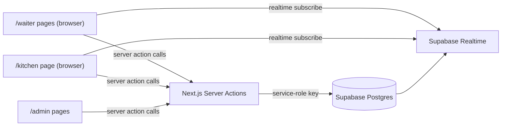

# Architecture Overview

## Purpose
Internal real-time ordering app for a single small restaurant/bar. It connects waiters and kitchen staff. No public users and no login.

## Stack
- Next.js (App Router, TypeScript, Tailwind CSS)
- Supabase (Postgres + Realtime), free tier
- Deployment: Vercel (free tier) for web app + Supabase (free tier) for database

## Data Flow

## Data Model
- `tables(id, name, status: free|occupied)`
- `menu_categories(id, name, sort_order)`
- `menu_items(id, category_id, name, price, is_available)`
- `orders(id, table_id, status: open|closed, created_at, closed_at)`
- `order_items(id, order_id, menu_item_id, name_snapshot, price_snapshot, quantity, status: pending|preparing|ready|served, created_at, updated_at)`

## Read/Write Pattern
- Reads:
  - Server Components fetch initial data with `lib/supabase/server.ts` (service-role key on server).
  - Client Components subscribe with `lib/supabase/client.ts` (anon key) for live UI updates.
- Writes:
  - All inserts/updates/deletes go through Next.js Server Actions in `app/actions/*.ts`.
  - RLS gives public/anon role read-only (`SELECT`) access; write operations remain server-only.

## Status Lifecycle
`pending` -> `preparing` -> `ready` -> `served`

Quantity can only be edited while item status is `pending`.

## Environment Variables
- `NEXT_PUBLIC_SUPABASE_URL`: Supabase project URL (client + server)
- `NEXT_PUBLIC_SUPABASE_ANON_KEY`: Browser client key (read-only in practice via RLS)
- `NEXT_PUBLIC_SUPABASE_PUBLISHABLE_KEY`: Optional browser key fallback if anon key env name is not used
- `SUPABASE_SERVICE_ROLE_KEY`: Server-only key for Server Actions

## How Realtime Sync Works
- Waiter table grid subscribes to `tables` for structural/status changes and re-fetches ready-item counts when `order_items` events arrive.
- Waiter table detail subscribes to `order_items` filtered by `order_id` and merges inserts/updates/deletes into local state.
- Kitchen board subscribes to `order_items`; on each event it re-fetches all non-served items for open orders and re-groups them into columns.
- All writes are made through Server Actions; UI state converges via Supabase Realtime events rather than optimistic-only local writes.

## Routes
- `/`: links to Waiter / Kitchen / Admin sections
- `/waiter`: table grid
- `/waiter/[tableId]`: menu picker + order details + running bill
- `/kitchen`: pending/preparing/ready board
- `/admin/menu`: categories and menu items CRUD
- `/admin/tables`: tables CRUD

## Deployment
1. Create Supabase project and run `supabase/schema.sql`.
2. Add env vars locally in `.env.local`.
3. Push repo to GitHub.
4. Import repo into Vercel and add the same env vars there.
5. Deploy.

## Known Limitations
- No authentication. Anyone with the URL can access the app.
- Supabase free projects can pause after long inactivity.
